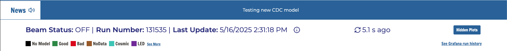
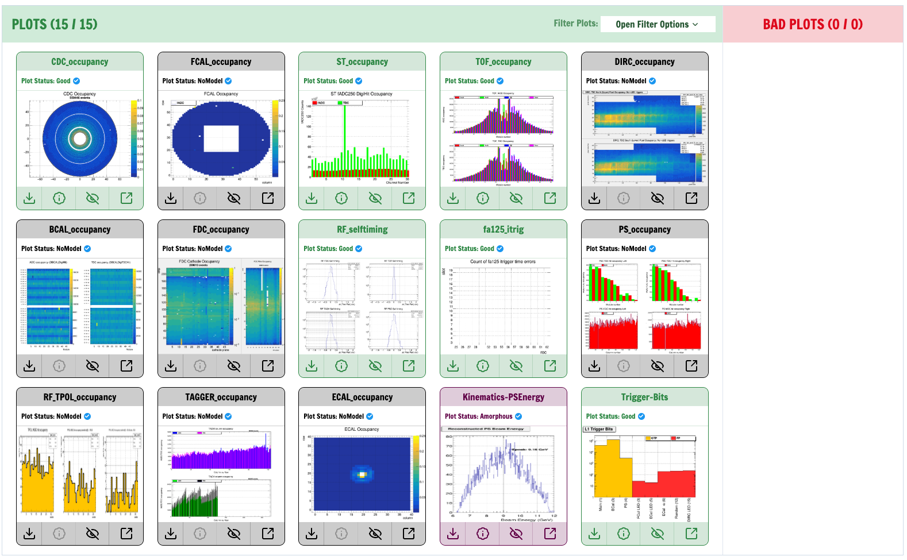

# Shift Crew User Guide

Shift crews at Jefferson Lab should monitor their respective Hydra Run Pages, which can be found on various wiki pages and at the links below. Chrome is the preferred browser. 

| Deployment  | Link                                   |
|-------------|----------------------------------------|
| Hall A      | [Hydra Run](https://epsciweb.jlab.org/sbs_hydra) |
| Hall B      | [Hydra Run](https://epsciweb.jlab.org/clas_hydra) |
| Hall C      | [Hydra Run](https://epsciweb.jlab.org/hallc_hydra) |
| Hall D      | [Hydra Run](https://epsciweb.jlab.org/gluex_hydra) |

The CUE login is required to view images. Depending on the experimental hall, the page will automatically update every minute (Hall D), every couple of minutes _when there is beam_ (Hall B), and once per run for Halls A and C. The page is automatically refreshed. 

Hydra is automatically started either via the DAQ or cron jobs. There is no need for the shift crews to "start" hydra on their own. 

# Navigating the Run page: 
The navbar contains a hamburger menu that links to all other Hydra pages. To make identifying our various deployments easier, we place the experiment logos on the right hand side next to the navbar. An example navbar from the GlueX deployment is shown below. 

Underneath the navbar, we have a news banner. This is used to quickly communicate relevant information about Hydra to our end users. 

The status indicator section provides information about the images the page shows. This includes a color legend, beam status, run number, and last update time _from the last set of images Hydra received_. The refresh icon is a polling indicator, which shows how often we are polling the relevant table to provide the latest inference results. If there are any hidden plots, you can view them by clicking on the hidden plots button. A screenshot of the status section is shown below. 

The remainder of the page is dedicated to displaying the images that Hydra knows about and their classifications. Bad plots will automatically move to the Bad Plots container. This separation was implemented for deployments that contain a large number of images. All other non-Bad classified plots will be shown in the Plots container. In addition, users can filter which plots are shown by their own customized "groups". By default, images are grouped by detector system.

# Troubleshooting: 

If the Run page is not showing any plots, and you are taking production data, it can indicate a potential problem with Hydra or the monitoring systems that send Hydra images (RootSpy in Hall D, mon12 in Hall B, Panguin in Halls A/C). If you suspect something is wrong, do not hesitate to contact us. 

If there is a bad plot, it is up to that particular detector expert to determine a policy for what to do. Most commonly, the shift crews will post a screenshot in the logbook and tag the relevant experts-- the same as usual for other existing monitoring tools. 

If the plot is "flickering" between good and bad, it is best to notify the detector experts and notify the Hydra team. We will work with detector experts to label images, train a new model, test the model, and put it into production. 

# Contact Hydra Team

The Hydra team can be contacted via hydrateam@jlab.org (all developers), tbritton@jlab.org (Thomas), and roark@jlab.org (Torri). We are also available on Mattermost, Slack, and Teams. Please specify the experimental hall when reaching out. 