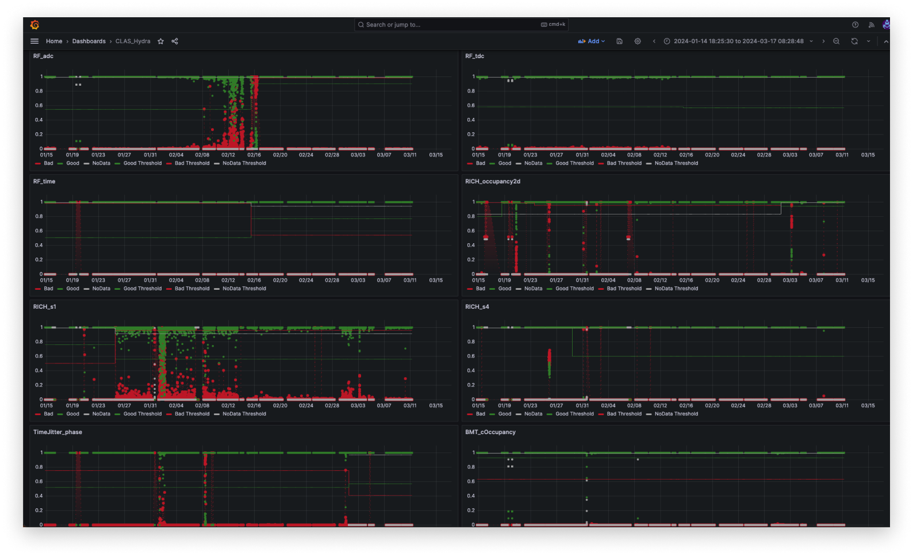

# Grafana Interface

A Grafana dashboard can be used to visualize the output weights from every inference,  for each active model, over time. In addition, one can plot the model thresholds. 

These visualizations are useful to anticipate when a model may need to be retrained.

