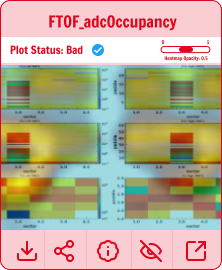

# Hydra Run 

## The Hydra Run page can be found at the following locations
Users should use their CUE account to login. 

| Deployment  | Link                                   |
|-------------|----------------------------------------|
| Hall A      | [Hydra Run](https://epsciweb.jlab.org/sbs_hydra) |
| Hall B      | [Hydra Run](https://epsciweb.jlab.org/clas_hydra) |
| Hall C      | [Hydra Run](https://epsciweb.jlab.org/hallc_hydra) |
| Hall D      | [Hydra Run](https://epsciweb.jlab.org/gluex_hydra) |

The Hydra Run page displays a "security cam" view of monitoring histograms and their classifications. The page automatically updates by polling the database for new images. The core component of the Hydra run page are the image cards. Each monitoring image is contained in its own image card, with text information in the card header and actions in the card footer. A detailed view and description of the image cards can be found below. 

Optionally, GradCAM (cite) heat maps can be overlayed for images that are classified as bad. These heat maps indicate where the model is looking when classifying a bad image. The opacity slider can be used to increase or decrease the opacity as needed. 

An example Hydra Run page from Hall B is shown below. 

