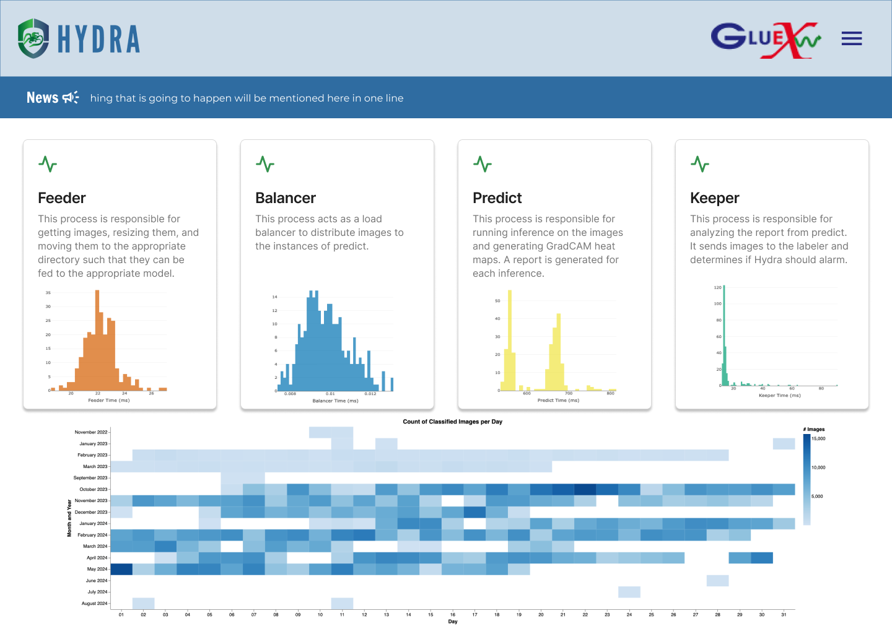

# Status

The status page is meant for Hydra developers to monitor the system status via timing measurements for each of the system processes. The page contains a brief description of each process, a histogram of the processing times for each image, and a heat map of the number of images analyzed per day. 

found below. 

